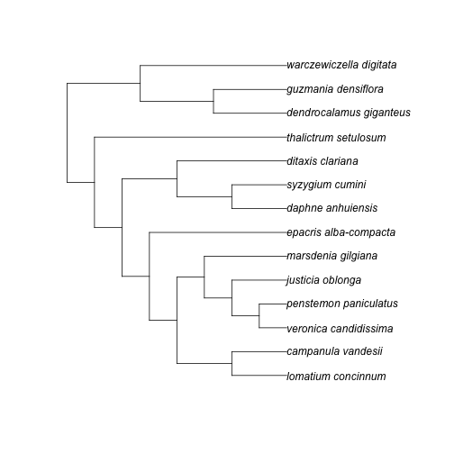

phylocomr
========


[](https://travis-ci.org/ropensci/phylocomr)
[](https://ci.appveyor.com/project/jeroenooms/phylocomr)

`phylocomr` gives you access to the Phylocom C library.

## Package API

* `ecovolve`/`ph_ecovolve` - interface to `ecovolve` executable, and a higher
level interface
* `phylomatic`/`ph_phylomatic` - interface to `phylomatic` executable, and a higher
level interface
* `phylocom` - interface to `phylocom` executable
* `ph_aot` - higher level interface to `aot`
* `ph_bladj` - higher level interface to `bladj`
* `ph_comdist`/`ph_comdistnt` - higher level interface to comdist
* `ph_comstruct` - higher level interface to comstruct
* `ph_comtrait` - higher level interface to comtrait
* `ph_pd` - higher level interface to Faith's phylogenetic diversity

## Installation


```r
install.packages("devtools")
devtools::install_github("ropensci/phylocomr")
```


```r
library("phylocomr")
library("phytools")
library("ape")
```

## ecovolve


```r
ph_ecovolve(speciation = 0.05, extinction = 0.005, time_units = 50)
```

```
#> [1] "((sp8:25.000000,((sp11:10.000000,sp12:10.000000)node5:5.000000,(sp13:4.000000,sp14:4.000000)node6:11.000000)node3:10.000000)node1:4.000000,(sp9:19.000000,(sp10:13.000000,(sp15:1.000000,sp16:1.000000)node7:12.000000)node4:6.000000)node2:10.000000)node0:21.000000;"
#> attr(,"status")
#> [1] 1
```

## phylomatic


```r
taxa_file <- system.file("examples/taxa", package = "phylocomr")
phylo_file <- system.file("examples/phylo", package = "phylocomr")
(taxa_str <- readLines(taxa_file))
```

```
#> [1] "campanulaceae/lobelia/lobelia_conferta"          
#> [2] "cyperaceae/mapania/mapania_africana"             
#> [3] "amaryllidaceae/narcissus/narcissus_cuatrecasasii"
```

```r
(phylo_str <- readLines(phylo_file))
```

```
#> [1] "(((((eliea_articulata,homalanthus_populneus)malpighiales,rosa_willmottiae),((macrocentrum_neblinae,qualea_clavata),hibiscus_pohlii)malvids),(((lobelia_conferta,((millotia_depauperata,(layia_chrysanthemoides,layia_pentachaeta)layia),senecio_flanaganii)asteraceae)asterales,schwenkia_americana),tapinanthus_buntingii)),(narcissus_cuatrecasasii,mapania_africana))poales_to_asterales;"
```

```r
ph_phylomatic(taxa = taxa_str, phylo = phylo_str)
```

```
#> [1] "(lobelia_conferta:5.000000,(mapania_africana:1.000000,narcissus_cuatrecasasii:1.000000):1.000000)poales_to_asterales;"
#> attr(,"taxa_file")
#> [1] "/var/folders/gs/4khph0xs0436gmd2gdnwsg080000gn/T//RtmpSt9yC3/taxa_cbe633bfab67"
#> attr(,"phylo_file")
#> [1] "/var/folders/gs/4khph0xs0436gmd2gdnwsg080000gn/T//RtmpSt9yC3/phylo_cbe66c8e11bb"
```

## aot


```r
traits_file <- system.file("examples/traits_aot", package = "phylocomr")
phylo_file <- system.file("examples/phylo_aot", package = "phylocomr")
traitsdf_file <- system.file("examples/traits_aot_df", package = "phylocomr")
traits <- read.table(text = readLines(traitsdf_file), header = TRUE,
  stringsAsFactors = FALSE)
phylo_str <- readLines(phylo_file)
ph_aot(traits = traits, phylo = phylo_str)
```

```
#> $trait_conservatism
#> # A tibble: 124 × 28
#>    trait trait.name  node  name   age Ntaxa N.nodes Tip.mn Tmn.rankLow
#>    <int>      <chr> <int> <chr> <dbl> <int>   <int>  <dbl>       <int>
#> 1      1     traitA     0     A     5    32       2   1.75        1000
#> 2      1     traitA     1     B     4    16       2   1.75         691
#> 3      1     traitA     2     C     3     8       2   1.75         675
#> 4      1     traitA     3     D     2     4       2   1.50         259
#> 5      1     traitA     4     E     1     2       2   1.00          52
#> 6      1     traitA     7     F     1     2       2   2.00        1000
#> 7      1     traitA    10     G     2     4       2   2.00        1000
#> 8      1     traitA    11     H     1     2       2   2.00        1000
#> 9      1     traitA    14     I     1     2       2   2.00        1000
#> 10     1     traitA    17     J     3     8       2   1.75         673
#> # ... with 114 more rows, and 19 more variables: Tmn.rankHi <int>,
#> #   Tip.sd <dbl>, Tsd.rankLow <int>, Tsd.rankHi <int>, Node.mn <dbl>,
#> #   Nmn.rankLow <int>, Nmn.rankHi <int>, Nod.sd <dbl>, Nsd.rankLow <int>,
#> #   Nsd.rankHi <int>, SSTipsRoot <dbl>, SSTips <dbl>,
#> #   percVarAmongNodes <dbl>, percVarAtNode <dbl>, ContributionIndex <dbl>,
#> #   SSTipVNodeRoot <dbl>, SSTipVNode <dbl>, SSAmongNodes <dbl>,
#> #   SSWithinNodes <dbl>
#> 
#> $independent_contrasts
#> # A tibble: 31 × 17
#>     node  name   age N.nodes Contrast1 Contrast2 Contrast3 Contrast4
#>    <int> <chr> <dbl>   <int>     <dbl>     <dbl>     <dbl>     <dbl>
#> 1      0     A     5       2  0.000000  0.000000  0.000000  0.254000
#> 2      1     B     4       2  0.000000  1.032795  0.000000  0.516398
#> 3      2     C     3       2  0.267261  0.534522  0.000000  0.000000
#> 4      3     D     2       2  0.577350  0.000000  1.154700  0.000000
#> 5      4     E     1       2  0.000000  0.000000  0.707107  0.000000
#> 6      7     F     1       2  0.000000  0.000000  0.707107  0.000000
#> 7     10     G     2       2  0.000000  0.000000  1.154700  0.000000
#> 8     11     H     1       2  0.000000  0.000000  0.707107  0.000000
#> 9     14     I     1       2  0.000000  0.000000  0.707107  0.000000
#> 10    17     J     3       2  0.267261  0.534522  0.000000  0.000000
#> # ... with 21 more rows, and 9 more variables: ContrastSD <dbl>,
#> #   LowVal1 <dbl>, HiVal1 <dbl>, LowVal2 <dbl>, HiVal2 <dbl>,
#> #   LowVal3 <dbl>, HiVal3 <dbl>, LowVal4 <dbl>, HiVal4 <dbl>
#> 
#> $phylogenetic_signal
#> # A tibble: 4 × 5
#>    Trait NTaxa VarContr VarCn.rankLow VarCn.rankHi
#>    <chr> <int>    <dbl>         <int>        <int>
#> 1 traitA    32    0.054             1         1000
#> 2 traitB    32    0.109             1         1000
#> 3 traitC    32    0.622            56          945
#> 4 traitD    32    0.011             1         1000
#> 
#> $ind_contrast_corr
#> # A tibble: 3 × 6
#>   XTrait YTrait Ntaxa  PicR  nPos nCont
#>    <chr>  <chr> <int> <dbl> <dbl> <int>
#> 1 traitA traitB    32 0.248  18.5    31
#> 2 traitA traitC    32 0.485  27.5    31
#> 3 traitA traitD    32 0.000  16.5    31
```

## bladj


```r
ages_file <- system.file("examples/ages", package = "phylocomr")
phylo_file <- system.file("examples/phylo_bladj", package = "phylocomr")
ages_df <- data.frame(
  a = c('malpighiales','salicaceae','fabaceae','rosales','oleaceae',
        'gentianales','apocynaceae','rubiaceae'),
  b = c(81,20,56,76,47,71,18,56)
)
phylo_str <- readLines(phylo_file)
(res <- ph_bladj(ages = ages_df, phylo = phylo_str))
```

```
#> [1] "((((((lomatium_concinnum:20.250000,campanula_vandesii:20.250000):20.250000,(((veronica_candidissima:10.125000,penstemon_paniculatus:10.125000)plantaginaceae:10.125000,justicia_oblonga:20.250000):10.125000,marsdenia_gilgiana:30.375000):10.125000):10.125000,epacris_alba-compacta:50.625000)ericales_to_asterales:10.125000,((daphne_anhuiensis:20.250000,syzygium_cumini:20.250000)malvids:20.250000,ditaxis_clariana:40.500000):20.250000):10.125000,thalictrum_setulosum:70.875000)eudicots:10.125000,((dendrocalamus_giganteus:27.000000,guzmania_densiflora:27.000000)poales:27.000000,warczewiczella_digitata:54.000000):27.000000)malpighiales:1.000000;"
```

```r
plot(phytools::read.newick(text = res))
```



## Meta

* Please [report any issues or bugs](https://github.com/ropensci/phylocomr/issues).
* License: MIT
* Get citation information for `phylocomr` in R doing `citation(package = 'phylocomr')`
* Please note that this project is released with a [Contributor Code of Conduct](CONDUCT.md). By participating in this project you agree to abide by its terms.

[](https://ropensci.org)
